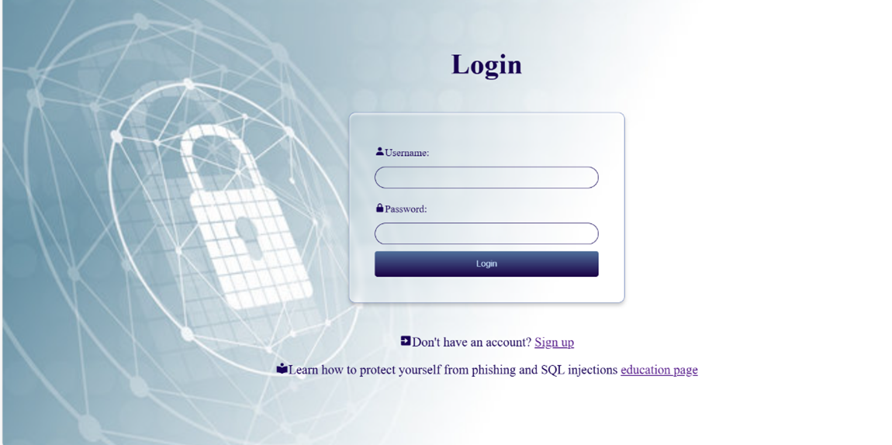

# 🔐 Secure Login System with Educational Component

##  Project Overview

This project is a **secure and user-friendly login system** built with Python (Flask) that protects against SQL injection attacks and includes strong password policies and encryption. Beyond technical functionality, it features an **educational page and quiz** to raise awareness about cybersecurity best practices, such as recognizing phishing attempts, creating strong passwords, and understanding social engineering.

---

##  Project Goals

- Develop a secure login and signup system
- Enforce strong password requirements (uppercase, lowercase, number, symbol, min 10 characters)
- Prevent SQL injection via input validation and parameterized queries
- Hash passwords using **bcrypt**
- Educate users on:
  - Phishing attacks
  - SQL injections
  - Strong password creation
- Test user knowledge with a cybersecurity quiz

---

##  Features

###  Login Page
- Allows users to log in with secure credentials
- Detects suspicious inputs (e.g. SQL keywords like `SELECT`, `INSERT`)
- Shows warnings for potentially malicious input
- Redirects successful logins to the welcome page (`youin.html`)
- Provides links to the signup and education pages

###  Signup Page
- New users can register with:
  - Unique usernames (5–20 characters)
  - Secure passwords (min 10 chars, includes uppercase, lowercase, number, and symbol)
- Passwords are validated and stored **hashed with bcrypt**
- Random password generator included
- Rejects suspicious or insecure inputs
- Links to the education page

###  Education Page
- Explains key security concepts:
  - Phishing and how to avoid it
  - SQL injection examples and prevention
  - Strong password tips
- Includes a **5-question quiz** with scoring
- Links back to login page

###  Quiz Page
- Interactive quiz tests understanding of cybersecurity topics
- Score is shown at the end
- Accessible after reviewing educational content

---

##  Technical Stack

- **Frontend:** HTML, CSS, JavaScript
- **Backend:** Python (Flask)
- **Database:** SQLite
- **Security:** bcrypt for password hashing
- **IDE:** Visual Studio Code with WSL (Ubuntu)

---

## How to Open and Set Up the Project

-  Extract the zipped project file and save it in the Ubuntu folder. Open the project in Visual Studio Code and ensure it is connected to WSL.
-  Open your terminal and install Python 3.13.0 on your laptop using the commands: `sudo apt update` and `sudo apt install python3.13`. 
-  Then, install the required libraries by running: `pip install flask bcrypt flask-wtf flask-sqlalchemy`. 
-  Make sure SQLite is installed by running: `sudo apt install sqlite3`. 
-  Finally, start the Flask development server by typing: `python3 app.py`.
-  The terminal will display a local URL (e.g., http://127.0.0.1:5000). Open this URL in your web browser to access the application.
